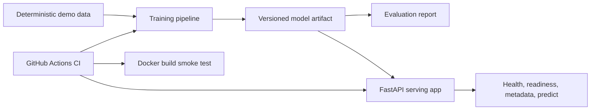

# NumPyForge Demo

This is a five-minute walkthrough for showing NumPyForge as a Backend/MLOps project.


## What To Show

NumPyForge starts with from-scratch NumPy models and ends with a production-style loop:



## Fastest Demo Path

Install development dependencies:

```bash
python -m pip install -e ".[dev]"
```

Run the portfolio demo:

```bash
make demo
```

Expected highlights:

- Processed dataset is generated deterministically.
- Logistic regression is trained from the project implementation.
- A versioned artifact is written under `models/current/`.
- The artifact is loaded by the FastAPI app.
- The demo calls `/health`, `/ready`, `/metadata`, and `/predict` through `TestClient`.
- A compact JSON summary prints accuracy, readiness, version, and sample prediction.

## Manual Workflow

Run the same flow step by step:

```bash
make quality
make coverage
make ingest
make train
make evaluate
make serve
```

In another terminal, inspect the API:

```bash
curl http://127.0.0.1:8000/health
curl http://127.0.0.1:8000/ready
curl http://127.0.0.1:8000/metadata
curl -X POST http://127.0.0.1:8000/predict \
  -H "Content-Type: application/json" \
  -d '{"features": [[0.0, 0.0], [1.0, 1.0]]}'
```

The same requests are available in [docs/api_examples.http](docs/api_examples.http) for editors
that support `.http` files.

## Recording A Short Demo

Use [docs/demo_recording.md](docs/demo_recording.md) as the shot list for a 60-90 second GIF or
screen recording. The recommended clip is simple: show the README badges and architecture, run
`make demo`, then show the green GitHub Actions `quality` and `docker-smoke` jobs.

## What To Say

- The model code is pure NumPy so the math is inspectable.
- The serving path uses artifact readiness instead of training a hidden fallback model at import.
- CI checks formatting, linting, typing, coverage, pipeline smoke tests, and Docker image build.
- Runtime data and artifacts are generated locally and intentionally ignored by git.

## Troubleshooting

- If `/ready` returns 503, run `make train` to create `models/current/`.
- If MLflow is not installed locally, training falls back gracefully while preserving the artifact
  workflow. A normal runtime install uses a local SQLite tracking backend.
- If Docker build fails locally with a socket error, start Docker Desktop or rely on the GitHub
  Actions Docker smoke job.
