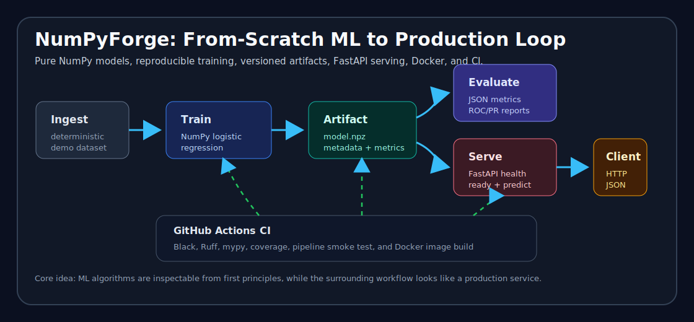

# NumPyForge

[](https://github.com/yashasviudayan-py/NumPyForge/actions/workflows/ci.yml)
[](https://www.python.org/)
[](https://numpy.org/)
[](https://fastapi.tiangolo.com/)
[](Dockerfile)
[](https://github.com/psf/black)
[](https://docs.astral.sh/ruff/)
[](https://mypy-lang.org/)

Custom machine learning components implemented from scratch with NumPy, plus a production-oriented training and serving scaffold.



## Project Links

- [Demo walkthrough](DEMO.md)
- [Case study](CASE_STUDY.md)
- [Portfolio and interview notes](PORTFOLIO.md)
- [API request examples](docs/api_examples.http)
- [Demo recording guide](docs/demo_recording.md)
- [GitHub presentation checklist](docs/github_polish.md)
- [Release notes](CHANGELOG.md)
- [Future roadmap](ROADMAP.md)
- [Release checklist](RELEASE.md)

## Quickstart

```bash
python -m venv .venv
source .venv/bin/activate
python -m pip install --upgrade pip
pip install -r requirements.txt
pytest
uvicorn api.main:app --reload
```

## What This Project Demonstrates

NumPyForge is a complete learning-to-production arc:

- Core ML math implemented with NumPy: validation, stable numerical helpers, losses, and
  estimator abstractions.
- Classical supervised learning from scratch: linear regression, logistic regression, softmax
  regression, gradient descent, regularization, sample weights, and class weights.
- Deep learning internals from scratch: dense layers, activations, dropout, losses,
  backpropagation, optimizers, learning-rate schedules, and MLP estimators.
- Evaluation discipline: train/test splits, cross-validation, model search, metrics, baselines,
  ROC/PR curves, and JSON-ready reports.
- Production loop: deterministic ingestion, training, MLflow-compatible tracking, versioned model
  artifacts, FastAPI serving, Docker packaging, and structured logs.
- Quality system: unit tests, finite-difference gradient checks, coverage reporting, pre-commit,
  and GitHub Actions CI.

## Why It Stands Out

This is intentionally more than an algorithm repo. The models are implemented from first principles,
then treated like production software: validated inputs, typed APIs, finite-difference checks,
artifact loading, readiness semantics, JSON reports, container smoke tests, and a recruiter-friendly
demo path. The project is designed so an interviewer can inspect the math, run the pipeline, and see
the service boundary without needing a notebook or hidden external dataset.

## One Command Path

After installing development dependencies, this path exercises the full local workflow:

```bash
python -m pip install -e ".[dev]"
make quality
make coverage
make demo
make ingest
make train
make evaluate
make docker-build
make serve
```

`make train` writes a local artifact under `models/current/`; `make serve` exposes it through the
FastAPI app. Runtime artifacts are ignored by git.

## Mini Case Study

**Problem:** most learning ML projects end at a notebook, while most MLOps examples hide the model
behind external libraries.

**Solution:** NumPyForge bridges both sides: it implements the learning algorithms in NumPy and wraps
them with the operational pieces expected in a backend/MLOps codebase.

**Result:** the project demonstrates numerical ML fundamentals, API design, artifact lifecycle,
testing discipline, Docker packaging, and CI/CD in one coherent repo. The longer version is in
[CASE_STUDY.md](CASE_STUDY.md).

## Project Layout

```text
.
├── api/                  # FastAPI application for model serving
├── configs/              # Runtime and experiment configuration
├── data/                 # Local data, ignored by git
├── examples/             # Developer examples and learning walkthroughs
├── models/               # Serialized model artifacts, ignored by git
├── pipeline/             # Data ingestion and training entrypoints
├── src/                  # Core NumPy ML library
└── tests/                # Unit tests
```

## Development Goals

- Implement core ML algorithms from first principles using NumPy.
- Keep model APIs close to scikit-learn: `fit`, `predict`, and typed configuration.
- Track experiments and artifacts with MLflow.
- Serve trained models through FastAPI.
- Keep the project Docker-ready from the beginning.

## Framework Conventions

NumPyForge estimators follow a small, explicit contract inspired by scikit-learn:

- `fit(X, y)` learns parameters from a feature matrix `X` with shape `(n_samples, n_features)`
  and a target vector `y` with shape `(n_samples,)`.
- `predict(X)` returns predictions with shape `(n_samples,)`.
- `score(X, y)` returns the estimator's default quality score: accuracy for classifiers and R2
  for regressors.
- Fitted attributes end in `_`, such as `weights_`, `bias_`, and `n_features_in_`.
- `save_parameters(path)` and `load_parameters(path)` round-trip fitted model state through NumPy
  `.npz` archives.

Core Phase 1 utilities live in:

- `src/base.py` for estimator abstractions, classifier/regressor bases, fitted-state checks, loss
  protocols, and parameter serialization.
- `src/validation.py` for reusable feature, target, class-label, and sample-weight validation.
- `src/math.py` for stable vectorized operations such as sigmoid, softmax, log-sum-exp, one-hot
  encoding, clipping, and L2 norms.
- `src/random.py` for deterministic random-state handling.

Run the estimator lifecycle example with:

```bash
python examples/estimator_lifecycle.py
```

## Classical ML Models

Phase 2 adds NumPy-only implementations of linear regression, binary logistic regression, and
multiclass softmax regression.

`LinearRegression` supports two solvers:

- `solver="normal_equation"` computes the closed-form least-squares solution with
  `np.linalg.pinv`. This handles ordinary least squares and ridge regression (`penalty="l2"`).
- `solver="gradient_descent"` minimizes mean squared error with the reusable optimizer in
  `src/optimizers.py`. This path supports no penalty, L1, and L2 regularization.

`LogisticRegression` supports binary and multiclass classification in one estimator:

- Binary classification uses the sigmoid likelihood and weighted binary cross-entropy.
- Multiclass classification uses softmax probabilities and categorical cross-entropy when
  `multi_class="multinomial"` or `multi_class="auto"` sees more than two classes.
- `predict_proba(X)` always returns shape `(n_samples, n_classes)`, including binary
  classification. Positive-class probabilities are in column `1` for binary labels.

Both linear and logistic models support:

- L1 and L2 penalties without regularizing the intercept/bias term.
- Batch, mini-batch, and stochastic gradient descent.
- Optional sample weights.
- Early stopping with deterministic validation splits.
- Training histories: `loss_history_`, `validation_loss_history_`, `gradient_norm_history_`,
  `parameter_norm_history_`, `n_iter_`, and `converged_`.

Logistic regression also supports `class_weight`, including explicit mappings and `"balanced"` for
imbalanced classification.

Run the Phase 2 example suite with:

```bash
python examples/classical_ml.py
```

## Neural Networks

Phase 3 adds a pure NumPy deep-learning layer with scikit-like `MLPClassifier` and `MLPRegressor`
estimators.

The public MLP API supports:

- `hidden_layer_sizes` for dense hidden-layer widths.
- Hidden activations: `relu`, `leaky_relu`, `sigmoid`, and `tanh`.
- Optimizers: `sgd`, `momentum`, `rmsprop`, and `adam`.
- Learning-rate schedules: `constant`, `step`, and `cosine`.
- Dropout on hidden activations with inverted-dropout scaling.
- L2 weight decay through `alpha`, excluding bias parameters.
- Training histories: `loss_history_`, `validation_loss_history_`, `learning_rate_history_`,
  `n_iter_`, and `converged_`.

Neural-network internals live under `src/neural_network/`:

- `layers.py` contains `Dense`, dropout, and activation layers.
- `losses.py` contains MSE, binary cross-entropy, and categorical cross-entropy losses.
- `initializers.py` contains zeros, normal, Xavier/Glorot, and He initialization.
- `network.py` runs ordered forward and backward passes.
- `gradient_check.py` provides central finite-difference gradient checking.

Shape conventions:

- Dense layers receive and return matrices with shape `(n_samples, n_units)`.
- `MLPClassifier.predict_proba(X)` returns probabilities with shape `(n_samples, n_classes)`.
- `MLPRegressor.predict(X)` returns a one-dimensional vector with shape `(n_samples,)`.

Run the Phase 3 example suite with:

```bash
python examples/neural_networks.py
```

## Validation And Evaluation

Phase 4 adds framework-native evaluation utilities for deterministic experiments and model
selection.

Data splitting and model selection live in `src/model_selection.py`:

- `train_test_split` supports deterministic shuffling and optional stratification.
- `k_fold_split` and `stratified_k_fold_split` yield train/test index pairs for cross-validation.
- `cross_val_score` clones dataclass estimators and accepts default estimator scoring, known
  scoring strings, or custom scorer callables.
- `grid_search_cv` and `randomized_search_cv` return `SearchResult` objects with the fitted best
  estimator, best parameters, best score, and fold-level results.

Metrics and reports live in `src/metrics.py`:

- Classification metrics include accuracy, confusion matrix, precision, recall, F1, log loss,
  ROC-AUC, PR-AUC, ROC curves, and precision-recall curves.
- Regression metrics include MAE, MSE, RMSE, R2, adjusted R2, and explained variance.
- `classification_report_dict` and `regression_report_dict` return JSON-ready summaries for local
  pipelines and future MLOps integration.

Simple deterministic baselines are available as `MajorityClassClassifier` and `MeanRegressor`.

Run the Phase 4 example and local evaluation pipeline with:

```bash
python examples/evaluation.py
python pipeline/evaluate.py
```

## Production And MLOps

Phase 5 turns the binary `LogisticRegression` demo into a local production loop:

- `python -m pipeline.ingest` creates a deterministic processed dataset.
- `python -m pipeline.train` trains the model, logs metrics to a local MLflow SQLite backend when
  available, and writes a versioned artifact under `models/current/`.
- `python -m pipeline.evaluate` loads the saved artifact and reports holdout metrics as JSON.
- `uvicorn api.main:app --reload` serves the saved artifact through FastAPI.

The serving API exposes:

- `GET /health` for process liveness.
- `GET /ready` for artifact readiness.
- `GET /metadata` for loaded model metadata and metrics.
- `POST /predict` for binary predictions and positive-class probabilities.

The API does not train a fallback model on import. If `models/current/` is missing or invalid,
readiness and prediction return HTTP 503 while health remains available. Runtime data, model
artifacts, and MLflow tracking files are intentionally ignored by git.

Common workflow commands are available through `make`:

```bash
make ingest
make train
make evaluate
make serve
make quality
make test
```

Post-`v0.1.0` ideas are tracked in `ROADMAP.md`.

## Testing And CI

Phase 6 enforces local and GitHub quality checks:

- GitHub Actions runs Black, Ruff, mypy, pytest coverage reporting, and pipeline smoke tests on
  pushes and pull requests to `main`.
- Coverage is reported with missing lines but does not currently enforce a minimum threshold.
- Pre-commit hooks are available for local formatting and file-hygiene checks.

Install the development extras and hooks with:

```bash
python -m pip install -e ".[dev]"
pre-commit install
```

Run the same local checks with:

```bash
make quality
make coverage
make ingest
make train
make evaluate
```
